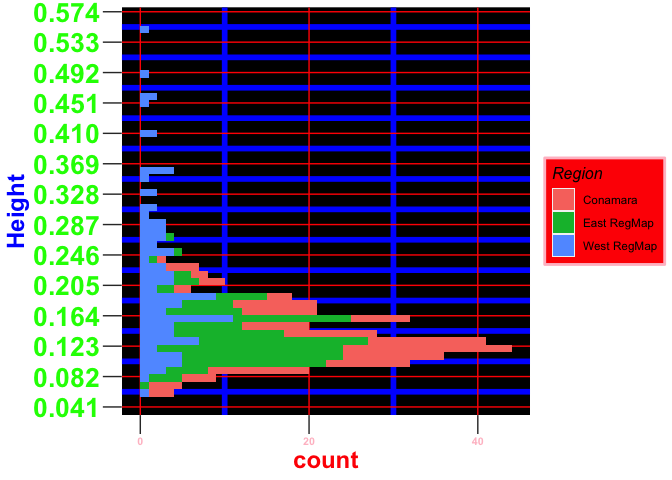
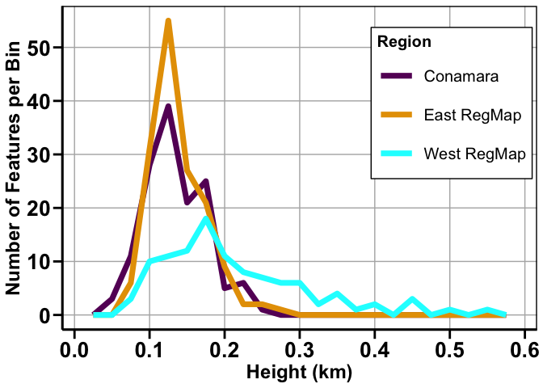

Homework 7
================
Helle Leth Skjetne
10/7/2020

``` r
#load packages
library(ggplot2)

#load data
setwd(dir = "/Users/helle/Documents/GEOL590/reproducible_data_analysis/homework/hw_07/")
europa <- read.csv("europa_data.csv", header = TRUE, sep = ",")
#europa #remove tag to view
```

Bad plot
--------

``` r
#Create Bad plot
eur_hgt_bad <- ggplot(data = europa, aes(y = Height, fill = Region)) +
  geom_histogram(binwidth = 0.01) + 
  theme(panel.background = element_rect(fill = "black"), 
          panel.grid.major = element_line(color = "red", size = 0.5),
          panel.grid.minor = element_line(color = "blue", size = 2),
          legend.title = element_text(size = 12, face = "italic"),
          axis.title.x = element_text(size = 18, face = "bold", color = "red"),
          axis.title.y = element_text(size = 18, face = "bold", color = "blue"),
          axis.text.y = element_text(size = 20, face = "bold", color = "green"),
          axis.text.x = element_text(size = 8, face = "bold", color = "pink"),
          axis.ticks.length = unit(0.5, "cm"),
        legend.background = element_rect(linetype = "solid", fill= "red", colour = "pink", size = 1)
) +  scale_y_continuous(breaks = seq(0,0.7, by = 0.041)) +  scale_x_continuous(breaks = seq(0,40, by = 20))

eur_hgt_bad #final bad plot
```



### Why is the plot above bad?

There are many reasons why the above plot is "bad"! First of all, the plot is really hard to interpret due to the diversity of colors utilized and would be hard to interpret to even people who are not color blind (as reds and greens are used together). Also, the black background in the plot makes it hard to read the data. The major and minor axes in the blot are also very difficult to interpret, as they use different colors and thicknesses, and it does not make sense how the major axis is thinner than the minor axis. The axis labels are also displayed in differing sizes and colors, which makes it really difficult to tie them together to the axis within the graph, and it would’ve been better if they are kept consistent. Another poor design feature of this graph is the horizontal bars showing height of features and the count per bin. In this case the binning is set at 0.041, which creates intervals on the y-axis labels (that also lacks units in kilometers) that is hard to tell what the interval between each tick is set at. This is also the case for the x-axis, where the interval is set at 20, and this makes it hard to see the count of observations that fall within each bin. The legend is also displayed outside the plot, which takes up extra space if the plot were to be displayed on a page (the plot could've been displayed overall larger if it were inside).

------------------------------------------------------------------------

Good plot
---------

``` r
# Create a template to apply to data

## Layout Template (basic template that can be applied to other plots)
histo_layout =  theme(
  axis.title.x = element_text(size = 18, face = "bold"),
  axis.title.y = element_text(size = 18, face = "bold"),
  legend.title = element_text(size = 15, face = "bold"),
  legend.text = element_text(size = 15),
  legend.key.size = unit(2.5, "lines"),
  axis.text.x = element_text(size = 20, face = "bold", color = "black"),
  axis.text.y = element_text(size = 20, face = "bold", color = "black"),
  panel.grid.major = element_line(color = "grey70", size = 0.5),
  panel.background = element_rect(fill = "white"),
  panel.border = element_rect(colour = "black", fill = NA, size = 1),
  axis.line.y = element_line(color = "black", size = 1),
  axis.line.x = element_line(color = "black", size = 1),
  axis.line.x.top = element_line(color = "black", size = 1),
  axis.ticks = element_line(color = "black", size = 1),
  axis.ticks.length = unit(0.3, "cm")
)

# Create good plot (with layout template above)
eur_hgt_good = ggplot(data = europa, 
                         aes(x = Height, color = Region)) + 
  geom_freqpoly(size = 2.5, 
                binwidth = 0.025, 
                linejoin = 'round') +
  scale_x_continuous(breaks = seq(0, 0.6, by = 0.1)) +
  scale_y_continuous(breaks = seq(0,100, by = 10)) +
  theme(legend.position = c(0.82,0.70), 
        legend.title = element_blank(), 
        legend.background = element_rect(linetype = "solid", colour = "black"), 
        legend.key = element_rect(fill = "white", colour = NA)) +
  scale_color_manual(values = c("#660066","#E69F00", "#00FFFF")) +
  labs(x = "Height (km)", y = "Number of Features per Bin", fill = "Location") 

eur_hgt_good + histo_layout #final good plot
```



### Why is the plot above good?

This plot is a much better representation of the data visualized in the first plot. The background is kept neutral and white and uses the same color for the major axes in this plot. The x and y axes are labelled with the same sized fonts, that is displayed in a font and font size that is easy to read. The x and y axes are also sufficiently described (e.g., using units for heights, and describing that the y axis shows number of features per bin). The plot uses a binning interval that shows 4 observations on the x axis, which can be determines without showing minor tick marks (for the purpose of this plot knowing precision/accuracy of the info between the major axis is not needed). The plot also uses colors that are color blind friendly, and that would show up as distinct colors if they were printed in black and white. The legend is also displayed inside the plot and does not interfere with the data displayed inside the plot area, but reduces the overall size of the plot so that it can be enlarged without being compromised by having the legend displayed outside of the plot taking up extra space. This histogram also has the height variable on the x-axis so that the data is displayed vertically instead as horizontally. Also, this histogram uses lines instead of bars, which makes it easier to read the general peak trends in the data. One thing that could've been done for this graph is to limit the amount of bins slightly but in this case I thought this was the best way to present the data.

------------------------------------------------------------------------
