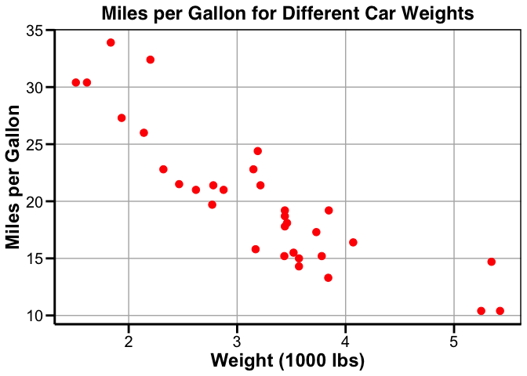

Homework 9
================
Helle Leth Skjetne
12/2/2020

``` r
# Load packages
library(ggplot2)
library(tidyverse)
library(dplyr)

# Set working directory
setwd("~/Documents/GEOL590/reproducible_data_analysis/homework/hw_09") #set working directory
getwd() #check working directory
```

    ## [1] "/Users/helle/Documents/GEOL590/reproducible_data_analysis/homework/hw_09"

``` r
### 1) Following R for Data Science exercise 19.2.1.4, write a function to calculate the variance of a numeric vector. Be sure that the function auto-prints the result if the result is not assigned to a variable.

#Create Data
set.seed(1)
x1 <- sample(1:15, 5)
x1 #returned  "6  1  5 11  4"
```

    ## [1] 9 4 7 1 2

``` r
#Make a function
varianceF <- function(x){
  x <- as.numeric(as.character(x))[!is.na(as.numeric(as.character(x)))] #convert to character, then numeric (NA if non numeric), then remove NAs
  sum((x-mean(x))^2) / (length(x)-1) #return variance result
}

#Use function
varianceF(x1) #returns 13.3
```

    ## [1] 11.3

``` r
#Check with other tool
var(x1) #returns 13.3, same as my function so this worked!
```

    ## [1] 11.3

``` r
#OR another method to calculate variance of a numeric vector:
varianceFun <- function(x, na.rm = TRUE) {
  n <- length(x)
  m <- mean(x, na.rm = TRUE)
  sq_err <- (x - m)^2
  sum(sq_err) / (n - 1)
}
varianceFun(x1) #returns 13.3
```

    ## [1] 11.3

``` r
#OR ANOTHER METHOD:
varianceFUNCTION <- function(x) {
  sum(((x - mean(x)))^2/(length(x)-1))
}

#test above method
varianceFUNCTION_sample <- sample(1:500, 5)
#using my function
varianceFUNCTION_test <- varianceFUNCTION(varianceFUNCTION_sample)
print(varianceFUNCTION_test) #result: 25943.3
```

    ## [1] 15754.3

``` r
#using built in function:
varianceFUNCTION_control <- var(varianceFUNCTION_sample)
print(varianceFUNCTION_control) #same as above (25943.3)
```

    ## [1] 15754.3

``` r
### 2) Write both_na(), a function that takes two vectors of the same length and returns the number of positions that have an NA in both vectors.

#both_na <- function(x, y) {
  #sum(is.na(x) & is.na(y))
#}
#both_na(
  #c(NA, NA, 1, 2),
  #c(NA, 1, NA, 2)
#)
#returns [1] 1 #'s of position(s) that have an NA in both vectors

#both_na(
  #c(NA, NA, 1, 2, NA, NA, 1),
  #c(NA, 1, NA, 2, NA, NA, 1)
#)
#returns [1] 3 #'s of position(s) that have an NA in both vectors

#above can be done in a more step by step process:
both_na_v2 <- function(x, y) {
  sum(is.na(x) & is.na(y))
}

na_1 <- c(NA, NA, 1, 2, NA, NA, 1)
na_2 <- c(NA, 1, NA, 2, NA, NA, 1)

both_na_v2_test <- both_na_v2(na_1, na_2)
print(both_na_v2_test)
```

    ## [1] 3

``` r
### 3) Write a function to create a specific kind of plot, with useful labels, etc., that can take a data frame as an argument. This is useful when you want to make multiple, similar plots from different data.


#load data
data(mtcars)

#create function to plot data
my.plot <- function() {
  result <- ggplot(data = mtcars, #insert data
                   aes(x = wt, #define x axis 
                       y = mpg)) + #define y axis
    labs(x = "Weight (1000 lbs)", #define x label text
         y = "Miles per Gallon") + #define y label text
    ggtitle("Miles per Gallon for Different Car Weights") + # define title
    geom_point(size = 3, color = "red") + #define plot type
    theme( #general theme
      axis.title.x = element_text(size = 18, face = "bold"),
      axis.title.y = element_text(size = 18, face = "bold"),
      legend.title = element_text(size = 15, face = "bold"),
      legend.text = element_text(size = 15),
      legend.key.size = unit(2.5, "lines"),
      axis.text.x = element_text(size = 15, color = "black"),
      axis.text.y = element_text(size = 15, color = "black"),
      panel.grid.major = element_line(color = "grey70", size = 0.5),
      panel.background = element_rect(fill = "white"),
      panel.border = element_rect(colour = "black", fill = NA, size = 1),
      axis.line.y = element_line(color = "black", size = 1),
      axis.line.x = element_line(color = "black", size = 1),
      axis.line.x.top = element_line(color = "black", size = 1),
      axis.ticks = element_line(color = "black", size = 1),
      axis.ticks.length = unit(0.3, "cm"), 
      plot.title = element_text(family = "Helvetica", 
                                  face = "bold",
                                  hjust = 0.5,
                                  size = (18)))
}

#plot the data
wt_mpg <- my.plot()
wt_mpg
```



``` r
### 4) Write a function that takes one argument and does the following:
       #- if the argument is a numeric vector, multiplies every number in the vector by 2
       #- if the argument is a character vector, sorts the vector into alphabetical order
       #- if the argument is anything else, issues an informative warning and returns the argument unchanged

argu_vec <- function(x){
  for (i in x) {
    if (is.character(x)) {
      sort(x)
  }
    if (is.numeric(x)) {
      x*2
    }
    else (warning("The input is neither a character or numeric vector"))
  }
}

#test the above function:
argu_vec_test_num <- sample(1:2000, 200)
argu_vec_test_char <- c("a", "b", "c", "d")

#test for numbers
test1 <- argu_vec(argu_vec_test_num)
print(test1)
```

    ## NULL

``` r
#test for characters
test2 <- argu_vec(argu_vec_test_char)
print(test2)
```

    ## NULL

``` r
### 5) Write a function that tries to calculate the mean of a vector using mean(). If that is successful, it returns the mean of the vector. If mean() throws an error, it issues an informative message and returns the input intact.


#create a vector using seq() function
#q5_vector <- seq(1,10, by=0.2)

#mymean <- function(m){
 #if(v < 0 || v > 10) stop('m is not between 0 and 10')
 #mean(q5_vector)
 #return(mymean)
#}

#myfunction <- function() {
  #meanres <- mean(q5_vector, na.rm = TRUE)
  #if (meanres = NA)
   # warning("Warning, issue!")
#}

#mean_val <- function(q5_vector) {
  #m <- mean(q5_vector)
#}

#result <- mean_val(q5_vector)
#return(result)

#get_mean <- function() {
 # result <- mean(q5_vector, na.rm)
  #if(result) {
   # print("True")
  #} else {
   # print("False")
  #}
  #return(result)
#}

#get_mean(q5_vector)

# OR LIKE THIS:
mean_test <- function(x){
  ifelse(is.numeric(x), mean(x), warning("Warning, issue! The mean cannot be found. X is likely not a numeric vector"))
}

#test the above function:
  #for values
vec1_mean_test <- sample(1:100, 10)
mtest1 <- mean_test(vec1_mean_test)
print(mtest1)
```

    ## [1] 43.5

``` r
  #for characters and integers
vec2_mean_test <- c(1, 5, "h", "i")
mtest2 <- mean_test(vec2_mean_test)
print(mtest2)
```

    ## [1] "Warning, issue! The mean cannot be found. X is likely not a numeric vector"

``` r
### 6) Use system.time() (or, if you want to be more advanced about it, the bench or microbenchmark packages) to compare how long it takes to add two, 1-million-element random vectors and store the result in a third vector: a. Using the vectorized sum() operation b. Using a for loop with a pre-allocated vector to store the results c. Using a for loop without pre-allocating a vector to store the results


#a. Using the vectorized sum() operation (e.g., `+`):
start_time1 <- Sys.time() #start timer

v1 <- sample(x=1:10, size = 1000000, replace = TRUE)
v2 <- sample(x=1:10, size = 1000000, replace = TRUE)

sum1 <- sum(v1 + v2)
end_time1 <- Sys.time() #end timer

time1 <- end_time1 - start_time1 #calculate time duration
time1 #0.0134871 secs
```

    ## Time difference of 0.08849287 secs

``` r
#b. Using a for loop with a pre-allocated vector to store the results:
#Note: look at other method below, as I am not sure if this is doing what the problem is asking:
start_time3 <- Sys.time()
a <- rnorm(1000000)
b <- rnorm(1000000)

answers <- NA

system.time({
  for(i in 1:1000000) {
    answers[i] <- a[i] + b[i]
  }
})
```

    ##    user  system elapsed 
    ##   0.261   0.051   0.315

``` r
for(i in 1:1000000) {
  answers[1] <- a[i] + b[i]
}
end_time3 <- Sys.time()

time3 <- end_time3 - start_time3
time3 #Time difference of 0.542021 secs
```

    ## Time difference of 0.554559 secs

``` r
#Another method for reference:
#start_time2 <- Sys.time()
#for(i in 1:length(v1)){
  #for(j in 1:length(v2)){
    #n <- vector()
    #n <- sum(v1[i]+v2[j])
  #}
  #m <-NULL
  #m[n]<-m
#}
#end_time2 <- Sys.time()
#time2 <- end_time2 - start_time2
#time2 #note: my computer could spent forever on this!!!

#b) or like this:
big_sum <- sample(1:10, 1000000,  replace = TRUE)
big_sum2 <- sample(1:10, 1000000, replace = TRUE)

sum_time2 <- system.time(
  for (i in 1:1000000) {
    big_sum[i] + big_sum2[i]
  }
)
print(sum_time2)
```

    ##    user  system elapsed 
    ##   0.037   0.000   0.037

``` r
#c. Using a for loop without pre-allocating a vector to store the results:
start_time4 <- Sys.time()
a <- rnorm(1000000)
b <- rnorm(1000000)

system.time({
  for(i in 1:1000000) {
    results <- a[i] + b[i]
  }
})
```

    ##    user  system elapsed 
    ##   0.070   0.003   0.072

``` r
end_time4 <- Sys.time()

time4 <- end_time4 - start_time4
time4 #Time difference of 0.281137 secs
```

    ## Time difference of 0.2380319 secs

``` r
# c) or like this:
#sum_time3 <- system.time(
#  for (i in 1:1000000) {
#    sample(1:10, 1000000, replace = TRUE)[i] + 
#      sample(1:10, 1000000, replace = TRUE)[i] 
#  }
#)
#print(sum_time3) #not this takes a lot of time!
```
